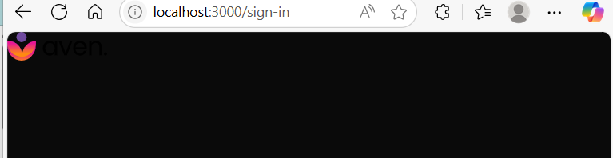

                    PROJECT OVERVIEW
- You’re creating a full-stack AI “personal assistant” web app.
- On the frontend, you use Next.js with React (styled via Tailwind CSS) to give users a chat interface and dashboard where they can manage and talk to their AI assistants. 
- On the backend, you leverage Convex, a serverless platform, to store user data, session info, and chat history in real time. 
- Finally, you integrate Eden AI as the AI engine that processes user messages and returns intelligent responses 
edenai.co

                    CHAPTER 1 - PROJECT SETUP
                **CREATE NEXT.JS PROJECT**
                **INSTALL UI COMPONENT LIBRARY (SHADCN)**

- once you run npm dev run
    you're starting Next.js development server, which by default listens on http://localhost:3001. The window that pops up is simply your systems default web browser loading that URL so you can preview and interact with your app as you develop it. 

- open ui.shadcn.com
    popular library and is intergrated 
    select docs > installation> next.js
    https://ui.shadcn.com/docs/installation/next
    we use tailwind 3.4.1 version 
    
    initialise this by copying the command (npx shadcn@latest init)
    into a new terminal and proceed > yes > select style > New York > Base color? > Neutral 
    == install successfully

    there will be a new folder called lib and another folder called components.json (configuration related to shadcn )
    the tailwind config file will have updated colors.
    if you want to update colors you can replace the lines inside the tailwind config  file
    whenever you want to use a shadcn component first you need to install the npx line into terminal and run it

                    CHAPTER 2 (DARK THEME/ DARK MODE)
                **ADD DARK THEME USING SHADCN**

- add dark theme component from shadcn 
    to do this we need to again copy command from shadcn component dark theme > paste it into terminal > run > then create provider.tsx in app folder> install react(ES7+ React/Redux/React-Native snippe extension) > install tailwind (Tailwind CSS IntelliSense) which helps do coding faster. 

    this provider.tsx will help us render on client side 
    and layout.tsx on server side. 

    when you set the provider.tsx to dark mode and run the server it will automatically change the font color to white   

    we also add <html suppressHydrationWarning={true}>
    -- to tell React if you notice a mismatch under here between the server rendered HTML and what youd render on the client please log that warning.

                    STEP 3 - AUTHENTICATION
                **GOOGLE/GMAIL AUTHENTICATION**
                **USER BASIC INFO (NAME, EMAIL, PROFILE PIC)**

- to add google authentication , use : React OAuth2 | Google
    log into google cloud > google auth platform > clients > copy client id and paste into provider.tsx.
- create .env.local file
    NEXT_PUBLIC_GOOGLE_CLIENT_ID api : when we use this on the client side you need to start the variable with next_public and mention key name. 

    to use this we use process.env inside provider.tsx
- if you want to make http://localhost:3001/sign-in:
    create sign-in.tsx file

    create page.tsx inside auth> sign in folder > page.tsx
    go to logo placeholder and copy svg of preferred logo and copy svg into logo.svg new file inside public folder. 

    

    https://react-oauth.vercel.app/ > GOOGLE AUTHENTICATION > IMPLICIT FLOW 

    - tokenResponse.access_token -- is an api

                    CHAPTER 4 (BACKEND DB SETUP)
        **Setup BackEnd DB with Convex DB**
        **Create user table**
        **Save User Data to Table**

- create convex account
    > npm i convex
    > npx convex dev
    > choose existing  project - ai personal assistant 
    == creates convex folder in github and also add convex deployment key and convex url into .env.local file
- edit provider.tsx --> create client component for convex provider 
    https://docs.convex.dev/quickstart/nextjs

-         if(user?.length==0)
        {
        //If not then only ->Add User
        const data={
            name:args.name,
            email:args.email,
            picture:args.picture,
            credits:5000
        }
        const result=await ctx.db.insert('users',data); // users table and pass as data
        return data
        }

                        CHAPTER 5 (AI ASSISTANTS TO PICK)
                    **NEW SCREEN TO DISPLAY LIST OF AI ASSISTANTS**
                    **SAVE USER SELECTED AI ASSISRANT**
                    **MAGIC UI ANIMATION LIBRARY**
                    

- so when you setup backend nd then sign in to your account a new record is added to the table , where the id is unique and creation Time is recorded. 

- if you sign in again, a new record will not be recorded it will only be verified. 
- this info can be found under console in inspect on browser.

-inside react we create " Context"  - which is context for application 
    - context folder > authcontext.tsx
    -make sure to import from react **
    